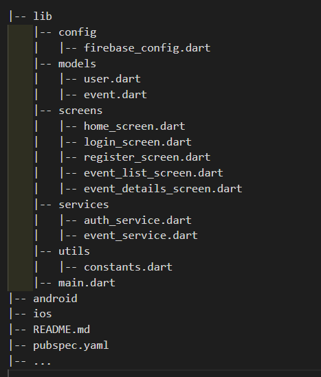

# Attendance Management System using Flutter-Firebase
## Overview
The Attendance Management System is a mobile application built using Flutter and Firebase that allows users to efficiently manage and record attendance for various events, classes, or meetings. This system provides an easy-to-use interface for both administrators and participants to mark attendance and view attendance records.

## Features
 - User Registration and Login: Users can sign up and log in to the application using their email and password credentials.

 - Admin and Participant Roles: The system distinguishes between administrators and participants, with different privileges for each role.

 - Event Creation: Administrators can create new events, providing event details such as date, time, location, and description.

 - Attendance Marking: Participants can mark their attendance for specific events, and the system records their attendance status.

 - Real-time Updates: The application uses Firebase to offer real-time attendance updates to all users.

 - Attendance Records: Administrators can view and export attendance records for each event.

## Installation and Setup
1.  Clone or download the repository from GitHub.
   ```
   git clone https://github.com/shreeramkedlaya/Attendance_Management_System_Flutter_Firebase.git
   ```
2. Make sure you have [Flutter](https://docs.flutter.dev/) and Dart installed on your development machine.
3. Set up a Firebase project and obtain the configuration files (google-services.json and GoogleService-Info.plist) for Android and iOS, respectively.
4. Replace the existing configuration files in the /android/app and /ios directories with your Firebase configuration files.
5. In the Firebase console, enable the Authentication and Firestore services for your project.
6. Update the Firebase configuration details in the lib/config/firebase_config.dart file.
7. Run the following command to get all the required dependencies:
``````
flutter pub get
``````
8. Now, you can run the application on a simulator or physical device using the following command:
``````
flutter run
``````
Project Structure
lua
Copy code

<!-- |-- lib
    |-- config
    |   |-- firebase_config.dart
    |-- models
    |   |-- user.dart
    |   |-- event.dart
    |-- screens
    |   |-- home_screen.dart
    |   |-- login_screen.dart
    |   |-- register_screen.dart
    |   |-- event_list_screen.dart
    |   |-- event_details_screen.dart
    |-- services
    |   |-- auth_service.dart
    |   |-- event_service.dart
    |-- utils
    |   |-- constants.dart
    |-- main.dart
|-- android
|-- ios
|-- README.md
|-- pubspec.yaml
|-- ... -->

## Technologies Used
- Flutter: A popular open-source UI software development kit by Google.
- Firebase: A cloud-based platform provided by Google for backend services such as authentication and real-time database.

## Contributing
Contributions to the project are welcome! If you encounter any issues or have suggestions for improvements, please create an issue or submit a pull request.

#### Thank you for using our Attendance Management System (Flutter + Firebase). If you have any questions or need further assistance, feel free to contact us.

#### Happy Attendance Management!